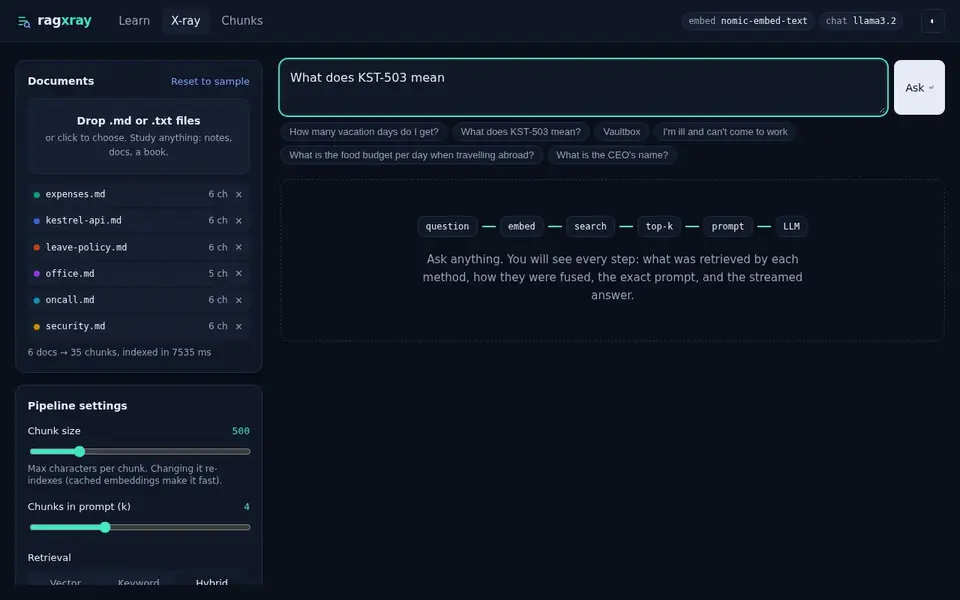
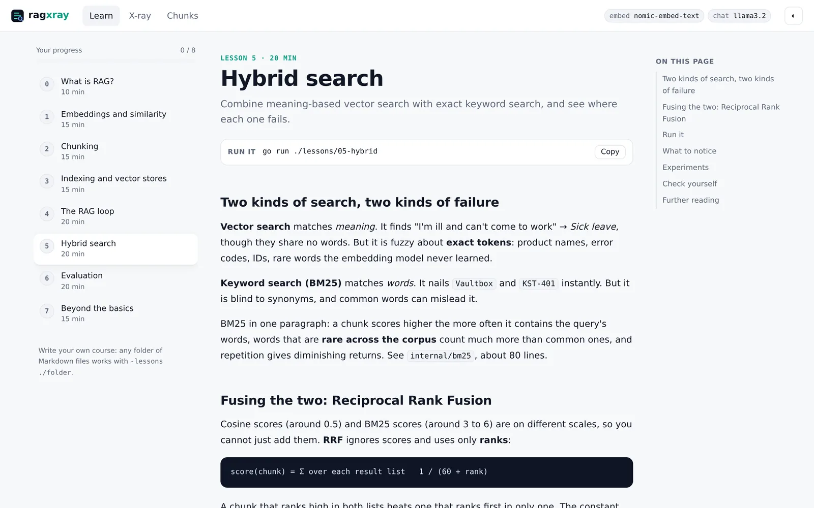
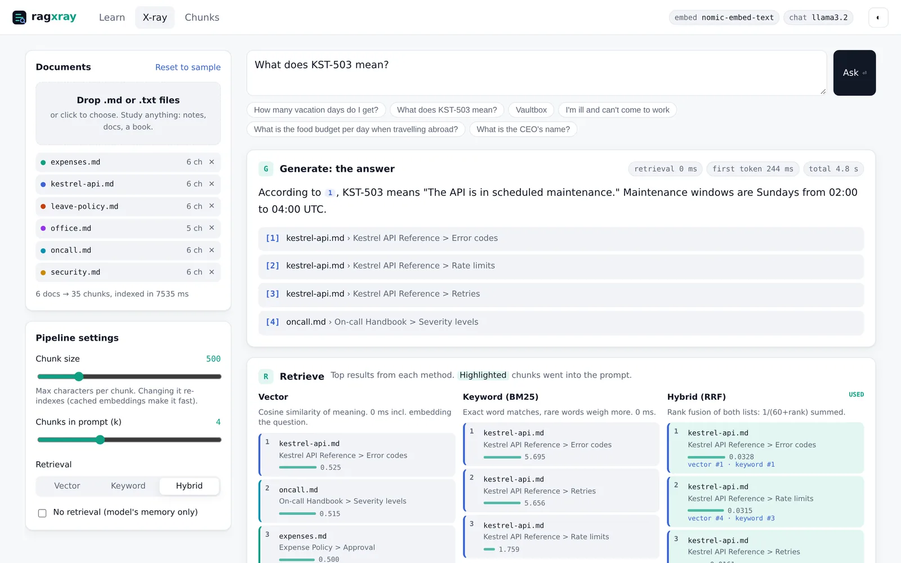
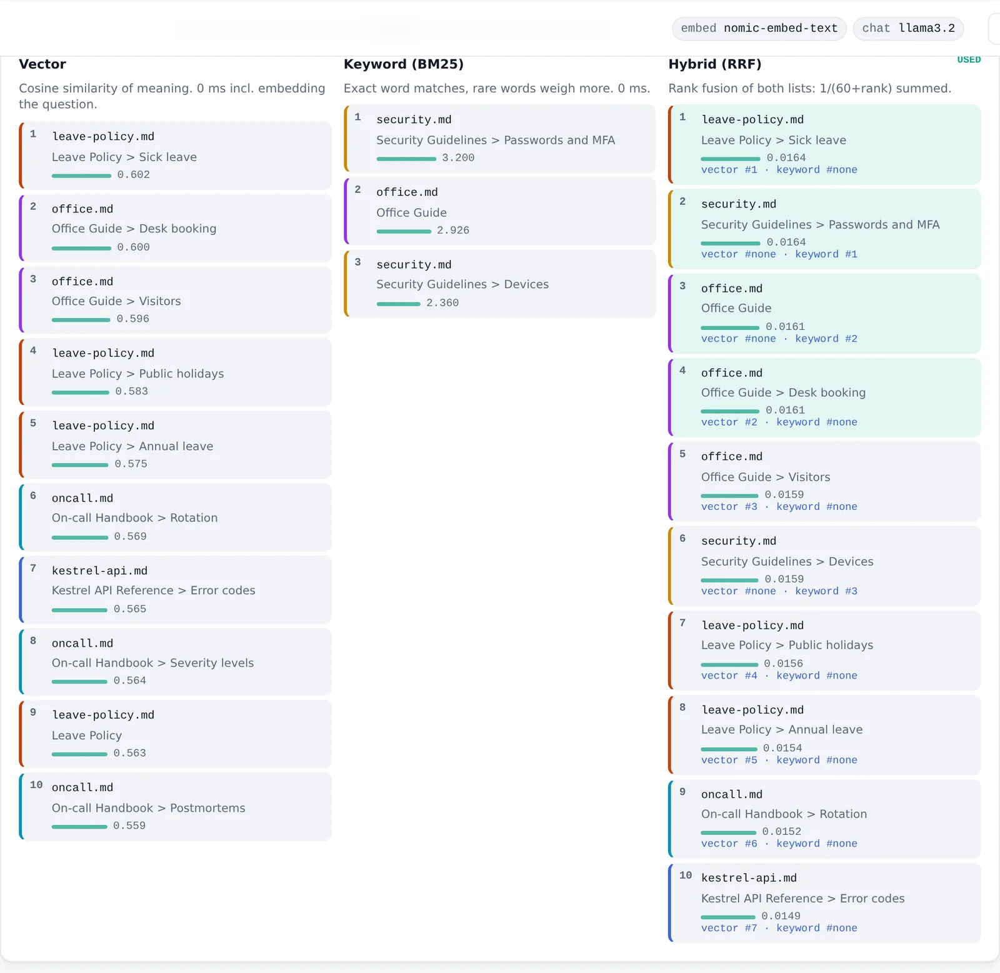
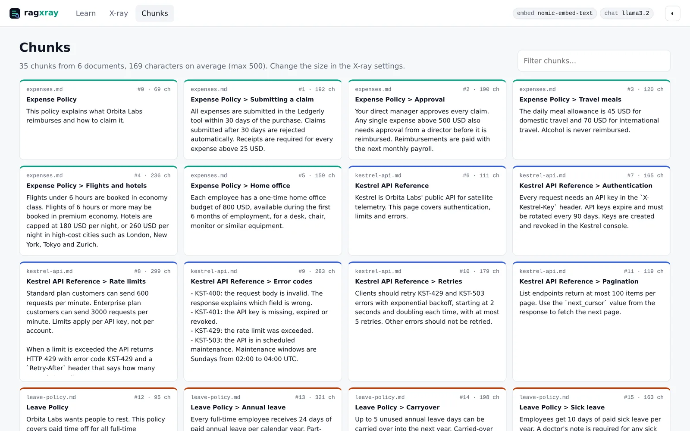
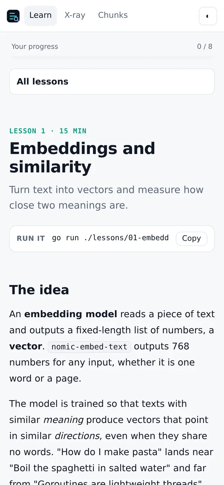

<div align="center">

# rag-xray

**Learn Retrieval-Augmented Generation by building it, then see inside every step.**

A hands-on RAG course in plain Go, plus a playground that X-rays the whole pipeline on *your own* documents.
Runs fully local with [Ollama](https://ollama.com), or with any AI API.

[](https://github.com/raj-khan/rag-xray/actions/workflows/ci.yml)
[](https://github.com/raj-khan/rag-xray/actions/workflows/docker.yml)
[](LICENSE)




</div>

## Why this exists

Most RAG tutorials hand you a framework and a notebook. It works, but you never *see* why it works, or why it fails.

rag-xray shows you every step:

- **Retrieve**: what vector search, keyword search (BM25) and their fusion each returned, and how fusion moved every chunk.
- **Augment**: the exact prompt the model received.
- **Generate**: the streamed answer, with clickable citations and timings.

Then turn the knobs (chunk size, k, retrieval mode, retrieval on or off) and watch the results change.

It is built for **learning**: small readable code, no framework, honest output. The lessons quote what the programs really print, including failures.

## Quick start

### Option 1: Docker, fully local (no installs, no API keys)

```sh
git clone https://github.com/raj-khan/rag-xray && cd rag-xray
docker compose up
```

Open **http://localhost:8080**. The first start downloads two small open models (about 2.3 GB) into a Docker volume.

### Option 2: Go + Ollama

```sh
ollama pull nomic-embed-text && ollama pull llama3.2
go run ./cmd/ragxray          # http://localhost:8080
```

### Option 3: any AI provider

Embeddings and answers are configured separately, so you can mix local and hosted models:

```sh
cp .env.example .env          # pick a recipe: OpenAI, Claude, Gemini, Groq, OpenRouter, LM Studio...
```

| Provider | Embeddings | Answers | Setting |
|---|:---:|:---:|---|
| Ollama (local, default) | ✓ | ✓ | nothing to set |
| OpenAI and any OpenAI-compatible API (OpenRouter, Groq, Gemini, LM Studio, llama.cpp, vLLM) | ✓ | ✓ | `EMBED_PROVIDER=openai` / `CHAT_PROVIDER=openai` + `*_BASE_URL` |
| Anthropic Claude | | ✓ | `CHAT_PROVIDER=anthropic` + `ANTHROPIC_API_KEY` |

Already running Ollama on your machine? Use the published image:

```sh
docker run --rm -p 8080:8080 --add-host=host.docker.internal:host-gateway \
  -e OLLAMA_HOST=http://host.docker.internal:11434 ghcr.io/raj-khan/rag-xray
```

## What's inside

### 1. A course you can read in the app or on GitHub

<picture>
  <source media="(prefers-color-scheme: dark)" srcset="docs/media/learn-dark.webp">
  
</picture>

| # | Lesson | Program |
|---|---|---|
| 0 | [What is RAG?](docs/lessons/00-what-is-rag.md) | |
| 1 | [Embeddings and similarity](docs/lessons/01-embeddings.md) | [`lessons/01-embeddings`](lessons/01-embeddings/main.go) |
| 2 | [Chunking](docs/lessons/02-chunking.md) | [`lessons/02-chunking`](lessons/02-chunking/main.go) |
| 3 | [Indexing and vector stores](docs/lessons/03-indexing.md) | [`lessons/03-index`](lessons/03-index/main.go) |
| 4 | [The RAG loop](docs/lessons/04-the-rag-loop.md) | [`lessons/04-ask`](lessons/04-ask/main.go) |
| 5 | [Hybrid search](docs/lessons/05-hybrid-search.md) | [`lessons/05-hybrid`](lessons/05-hybrid/main.go) |
| 6 | [Evaluation](docs/lessons/06-evaluation.md) | [`lessons/06-eval`](lessons/06-eval/main.go) |
| 7 | [Beyond the basics](docs/lessons/07-beyond-the-basics.md) | reading map |

Each lesson has the idea, a program to run, real output, experiments and self-check questions. About two hours in total.

### 2. The X-ray playground

<picture>
  <source media="(prefers-color-scheme: dark)" srcset="docs/media/xray-dark.webp">
  
</picture>

Where retrieval methods disagree, you can see it. Here vector search finds *Sick leave* for "I'm ill and can't come to work", but keyword search matches the word "work" elsewhere, and fusion pushes the right chunk down:

<picture>
  <source media="(prefers-color-scheme: dark)" srcset="docs/media/retrieval-dark.webp">
  
</picture>

### 3. Study anything

- **Your documents**: drag `.md` or `.txt` files into the X-ray (notes, docs, a book) and ask them questions. Or from the CLI: `go run ./lessons/03-index -data ~/notes`.
- **Your own course**: any folder of Markdown files becomes a course in the reader: `go run ./cmd/ragxray -lessons ./my-course`. See [CONTRIBUTING](CONTRIBUTING.md#writing-a-lesson) for the front matter.
- **Shareable questions**: `http://localhost:8080/#/xray?q=your+question`

<p align="center">&nbsp;&nbsp;</p>

## Results on the sample corpus

The sample documents describe a fictional company, so the model cannot know the answers without retrieval. With `nomic-embed-text` and `llama3.2` (3B) on 18 paraphrased questions:

| Retrieval | hit@1 | hit@4 | MRR |
|---|---|---|---|
| Vector | 0.83 | 1.00 | 0.90 |
| Keyword (BM25) | 0.78 | 0.94 | 0.85 |
| Hybrid (RRF) | 0.83 | 1.00 | 0.91 |

Answers: 15/18 correct. Every failure had the right passage in the prompt; [lesson 6](docs/lessons/06-evaluation.md) digs into why.

## Project layout

```text
cmd/ragxray        the web app (one binary, assets embedded)
lessons/NN-*       one small program per lesson
docs/lessons       lesson text, rendered by the app
internal/ai        providers: Ollama, OpenAI-compatible, Anthropic
internal/chunk     fixed-size and Markdown-aware chunking
internal/bm25      keyword search in ~80 lines
internal/retrieve  indexing, vector/keyword/hybrid search, prompt
internal/server    HTTP API with a streamed X-ray endpoint
web/static         plain HTML, CSS and JS, no build step
data               sample corpus and labelled eval set
```

Common tasks: `make run`, `make test`, `make lint`, `make eval`, `make up`.

## Learn more elsewhere

rag-xray covers the core pipeline. These excellent projects go further, and inspired parts of this one:

- [NirDiamant/RAG_Techniques](https://github.com/NirDiamant/RAG_Techniques): the biggest catalogue of advanced techniques
- [langchain-ai/rag-from-scratch](https://github.com/langchain-ai/rag-from-scratch): videos and notebooks
- [pguso/rag-from-scratch](https://github.com/pguso/rag-from-scratch): local-first RAG in JavaScript
- [microsoft/rag-time](https://github.com/microsoft/rag-time): a five-week course
- [Anthropic: Contextual Retrieval](https://www.anthropic.com/news/contextual-retrieval): the case for contextual chunks, hybrid search and reranking

Full credits in [ACKNOWLEDGEMENTS.md](ACKNOWLEDGEMENTS.md).

## Contributing

Lesson fixes, experiments, translations, providers and UI improvements are all welcome. Start with [CONTRIBUTING.md](CONTRIBUTING.md). Please follow the [Code of Conduct](CODE_OF_CONDUCT.md), and report security issues privately as described in [SECURITY.md](SECURITY.md).

## License

[MIT](LICENSE)
